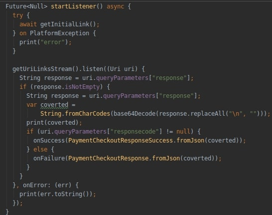

# flutter_lio_integration

Projeto que demonstra a integração Híbrida entre Flutter e Cielo LIO.

## Apresentação

O objetivo da Integração Híbrida da Cielo LIO, é permitir que o aplicativo desenvolvido em Flutter se integre com o módulo de pagamento da Lio, utilizando como recurso auxiliar a aplicação
Uri AppClient.

Nesse modelo de integração, todo o fluxo de pagamento passa pela aplicação auxiliar Uri AppClient, que comunica diretamente com Cielo Lio Order
Manager SDK.

* O aplicativo do parceiro rodando na Cielo envia informações para o Uri AppClient.
* O Uri AppClient comunica com a Cielo LIO Order Manager SDK que em seguida executa os fluxos para pagamento.
* O aplicativo do parceiro recebe as informações do pagamento e continua sua execução.

1. O aplicativo do parceiro é responsável por gerenciar todas as informações do pedido e, então, enviá-las para o Uri AppClient através da sua aplicação Flutter.
2. O Uri AppClient faz a comunicação com o Cielo LIO Order Manager SDK recebe as informações e o fluxo de pagamento para o cliente. Neste fluxo, o cliente irá selecionar a forma de pagamento e digitar a senha no Pinpad, tendo a possibilidade de enviar por e-mail o comprovante do pagamento.
3. Ao término do fluxo de pagamento, o aplicativo do parceiro recebe as informações sobre o pagamento realizado atraves Deep Linking.

## Observações:
Para fazer uso do exemplo, é necessário alterar os valores das constants, dentro de /lib/contants.dart:

* ACCESS_TOKEN: Identificação do token de acesso, que armazena as regras de acesso permitidas ao Client ID. 
Sua geração ocorre no momento da criação do Client ID pelo painel do desenvolvedor. 
Seu valor pode ser visualizado clicando em ‘detalhes’ na coluna ‘Access Tokens’, dentro do menu 
['Client ID Cadastrados'](https://desenvolvedores.cielo.com.br/api-portal/myapps)

* CLIENT_ID: Identificação de acesso. Sua geração ocorre no momento da criação pelo painel do desenvolvedor. 
Seu valor pode ser visualizado na coluna Client ID, dentro do menu 
['Client ID Cadastrados'](https://desenvolvedores.cielo.com.br/api-portal/myapps)

## Alguns pontos importantes a serem observados no exemplo:
* No pacote Android arquivo Manifest é necessário a declaração da intent filter:

* Função responsável por fazer a chamada via deep linking:

* Função listener, responsável por ficar aguardando callBack da transação:

## Libs Auxiliares
Foi necessário o uso das bibliotecas auxiliares:

Url_Launcher - [url_launcher](https://pub.dev/packages/url_launcher#-readme-tab-)

Uni_Links - [uni_links](https://pub.dev/packages/uni_links) 
